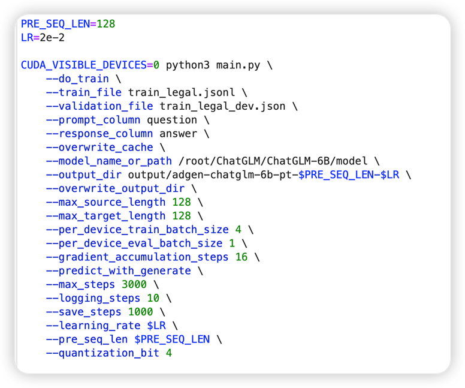

# LLM训练及测试

> *笔记作者：孙国恒，余杰，骆思缘@无糖实习*  
> *笔记小编：黄诚@安全学术圈*

## 使用的数据集
   
   CrimeKgAssitant_52k
   1. LaWGPT提供的法律数据集 
   2. 共有52k 
   3. 转换成了alpaca模板，即instruction-input-output的形式 
   4. 转换成了vicuna模板，即USER-ASSISTANT的形式
   5. 转换成了ChatGLM模板，即question-answer的形式

   
## 训练了什么模型

1. **Chinese-LLaMA-Plus-7B**

   1. 特性
      1. 扩充词表 
      2. 120G中文语料 
      3. LoRA finetune 
      4. 合并
   
   2. LoRA finetune
      1. 超参
         
      2. 模板：alpaca
      3. lora设置
         1. Lora_rank = 256 
         2. 应用到所有线性层 
         3. 微调参数量8.5%
      
         
      4. 训练过程
         
      5. 问答示例
         1. 问题
            
         2. epoch3的回答
            
         3. epoch6的回答
            
      6. epoch6过拟合后遇到的问题
         1. 泄露训练数据
            
         2. 重复
            
   3. full finetune
      1. 超参
         
      2. 模板：vicuna
      3. 训练过程
         
   4. 问答示例
      1. 问题
         
      2. 回答
         

2. **ChatGLM**

   1. P-tuning v2
      1. 超参
          
      2. 训练过程
         
         
      3. 回答示例
         1. ChatGLM
            
         2. ChatGLM_Ptuning
            

## GPT3.5评判训练效果

1. 如何测评
   选取基准模型ChatGLM，利用gpt3.5来测试待测模型在16个问题上能达到ChatGLM性能的百分比。

2. 总览
    
   NOTE：命名规则——数据集_batchSize_epoch_(重复惩罚的值)_使用模板

3. ptuning在ChatGLM上的效果
   1. 得分
      
   2. 结论
      1. 从数值上看，Ptuning效果不如未经过垂直领域数据微调的ChatGLM
      2. 然而，人工评阅后发现，ChatGLM_Ptuning的回答更加简短，且有未正常截断的情况，但在某些问题上有更强的理解能力
         1. ChatGLM
         
         2. ChatGLM_Ptuning
         
      3. 垂直领域数据微调后的模型在基本问答方案的能力遭到了破坏
         1. 问题
            
         2. 回答
            
      
4. full finetune跟ChatGLM的对比
   1. 得分
      
   2. 回答示例
      1. 示例1
         1. 问题
            
         2. law_batch128_epoch6_penalty1.2_vicuna的回答，得分109.9%
            
         3. law_batch128_epoch3_vicuna的回答，得分99.3%
            
      2. 示例2
         1. 问题
            
         2. law_batch128_epoch6_penalty1.2_vicuna的回答，得分109.9%
            
         3. law_batch128_epoch3_vicuna的回答，得分99.3%
            
      3. 示例3
         1. 问题
            
         2. law_batch128_epoch6_penalty1.2_vicuna的回答，得分109.9%
            
         3. law_batch128_epoch3_vicuna的回答，得分99.3%
            
   3. 结论
      1. 回答示例中，得分低的模型，给出的答案不一定差，反而会更好
      2. 模型的回答跟重复惩罚，是否过拟合还有关系，但gpt3.5并不能捕捉到这种差别
      3. 总之，gpt3.5评判不完全客观，对于垂直领域的模型，需要在评判中引入人工因素

## 问题总结

1. 灾难性遗忘——垂直领域数据微调后的模型，可能在基本问答方面表现不佳
2. 评价不客观——GPT在垂直领域问题的评判上可能和人工评判有偏差
3. 数据泄露——模型可能会泄露预训练/指令微调时的数据
