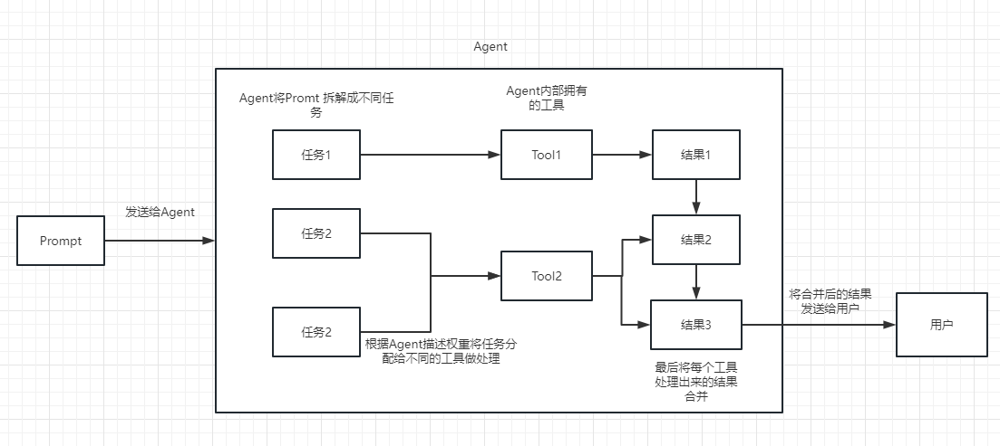
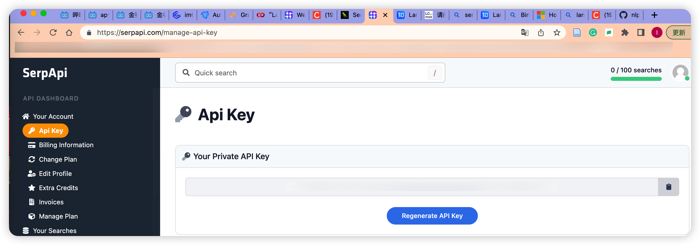
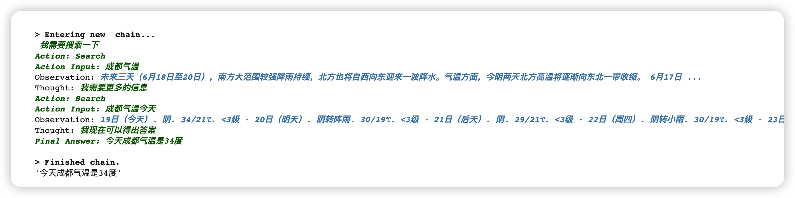
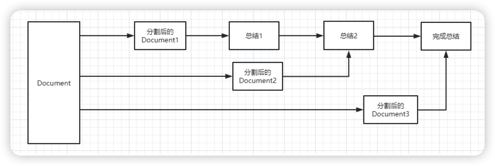
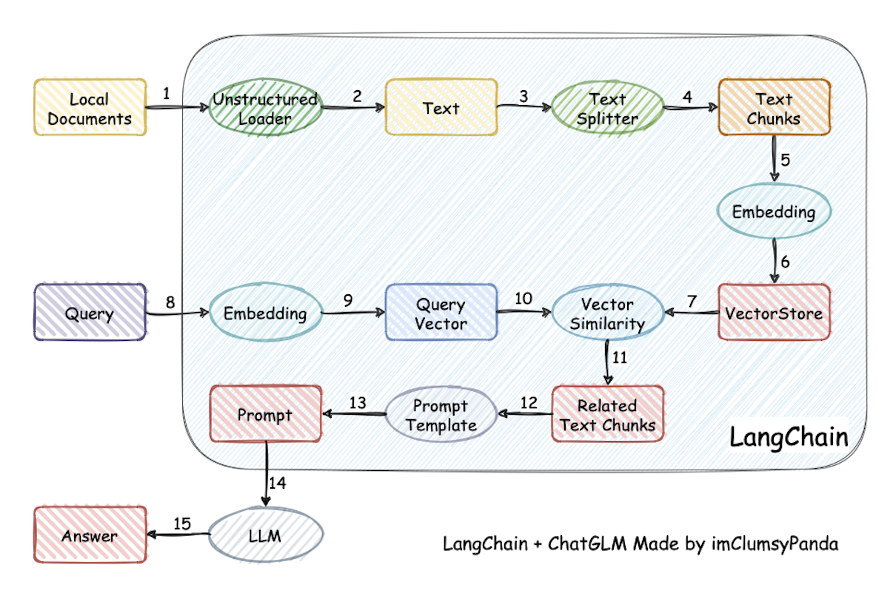
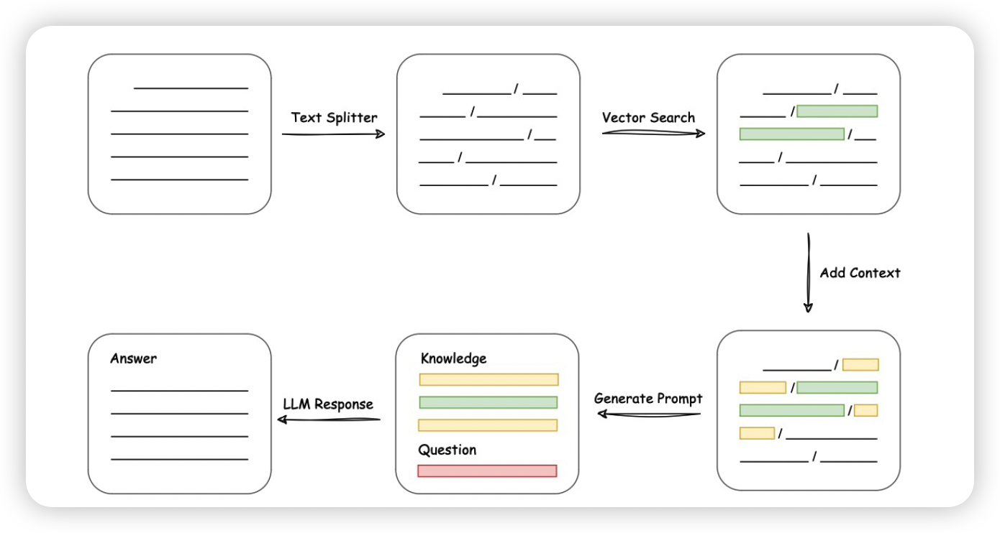
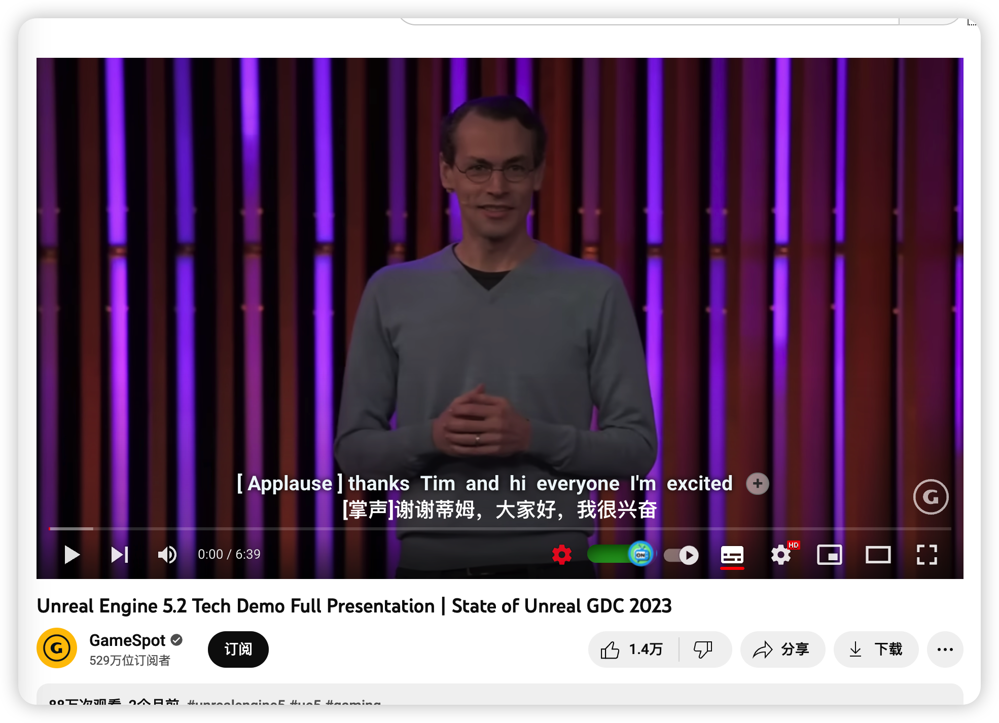
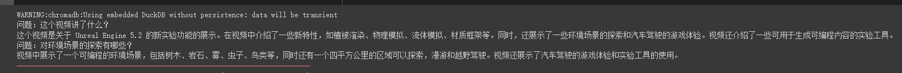

## LLM+langchain

LangChain是一个强大的框架，旨在帮助开发人员使用语言模型构建端到端的应用程序。它提供了一套工具、组件和接口，可简化创建由大型语言模型 (LLM) 和聊天模型提供支持的应用程序的过程。LangChain 可以轻松管理与语言模型的交互，将多个组件链接在一起，并集成额外的资源，例如 API 和数据库。

### 主要功能：

> 调⽤语⾔模型（支持多种模型接口，比如 OpenAI、Hugging Face、AzureOpenAI ...）
>
> 将不同数据源接⼊到语⾔模型的交互中(PDF,markdown,word,txt,csv)
>
> 各种工具链

### 概念：

#### Chain 链

我们可以把 Chain 理解为任务。一个 Chain 就是一个任务，当然也可以像链条一样，一个一个的执行多个链。

#### Agent 代理

我们可以简单的理解为他可以动态的帮我们选择和调用chain或者已有的工具。

执行过程可以参考下面这张图:




### 实践例子

#### 1.langchain调用google回答问题

让我们的 OpenAI api 联网搜索，并返回答案给我们。

这里我们需要借助 Serpapi 来进行实现，Serpapi 提供了 google 搜索的 api 接口。

首先需要我们到 Serpapi 官网上注册一个用户，https://serpapi.com/ 并复制他给我们生成 api key。



```python
from langchain.agents import load_tools
from langchain.agents import initialize_agent
from langchain.llms import OpenAI
from langchain.agents import AgentType

# 加载 OpenAI 模型
llm = OpenAI(temperature=0,max_tokens=2048)

 # 加载 serpapi 工具
tools = load_tools(["serpapi"])
# 工具加载后都需要初始化，verbose 参数为 True，会打印全部的执行详情
agent = initialize_agent(tools, llm, agent=AgentType.ZERO_SHOT_REACT_DESCRIPTION, verbose=True)

# 运行 agent
agent.run("今天成都气温是多少度")
```

在 chain 和 agent 对象上都会有 `verbose` 这个参数，这个是个非常有用的参数，开启他后我们可以看到完整的 chain 执行过程。

Answer:




#### 2.对超长文本进行总结

假如我们想要用 openai api 对一个段文本进行总结，我们通常的做法就是直接发给 api 让他总结。但是如果文本超过了 api 最大的 token 限制就会报错。

这时，我们一般会进行对文章进行分段，比如通过 tiktoken 计算并分割，然后将各段发送给 api 进行总结，最后将各段的总结再进行一个全部的总结。

如果用LangChain，他很好的帮我们处理了这个过程，使得我们编写代码变的非常简单。



这种方式会先总结第一个 document，然后在将第一个 document 总结出的内容和第二个 document 一起发给 llm 模型在进行总结，以此类推。这种方式的好处就是在总结后一个 document 的时候，会带着前一个的 document 进行总结，给需要总结的 document 添加了上下文，增加了总结内容的连贯性。

```python
输入一篇关于隐私计算的论文：
```

```
总结：本文回顾了隐私计算的发展历程，这一技术为数据流通的关键环节提供了解决方案，以释放其价值。 Gartner的2021 Preemptive Technology Strategies将隐私计算确定为重点研究方向，并将其列为未来几年的“九大趋势”之一。多方安全计算由姚期智于 20 世纪 80 年代提出，提供了一种安全的数据保护方式，允许每个参与方只能访问计算结果，而不能访问其他参与者的任何输入信息。隐私计算的发展伴随着公钥密码学的出现和同态加密的应用，使得基本的加密操作能够以更高的性能进行，直接完成双方之间的加密数据操作。此外，多方​​安全计算的实现包括多个关键的底层密码协议或框架，如不经意传输、乱码电路、同态加密等，可以看作是数据传输和交互过程中保护隐私的解决方案之一。审查还包括隐私计算发展带来的挑战和机遇，例如需要平衡数据利用与数据安全、密码学与可信硬件的结合以及需要构建更完整的因子分解市场体系。
```

#### 3.构建本地知识库

⼤语⾔模型通常基于通识知识进⾏训练，因此在⾯向如下场景时，常常需要借助**模型微调**或**提示词⼯程**提升语⾔模型应⽤效果：

- 垂直领域知识

- 基于私有数据的问答

|            | 是什么                                                       | 适用场景                                                     |
| ---------- | ------------------------------------------------------------ | ------------------------------------------------------------ |
| 微调       | 针对**预先训练**的语言模型，在**特定任务**的**少量**数据集上对其进行进一步训练 | 当任务或域定义明确，并且**有足够的标记数据**可供训练时，通常使用微调过程。 |
| 提示词工程 | 涉及设计自然语言**提示**或**指令**，可以指导语言模型执行特定任务。 | 最适合需要**高精度**和**明确输出**的任务。提示工程可用于制作引发所需输出的查询。 |


原理：



langchain首先将知识库读取成文本，拆分成一个个段落（到步骤4）。每个段落做Embedding（步骤5、6），可以用OpenAI接口做或者用其他语言模型。Embedding就是生成能够表达该文本含义的一个向量。接着把每个段落产生的向量都存进VectorStore里。后续用户输入query时，也生成query的embedding，和VectorStore里面的向量做相似度匹配，相似度较高的文本可以认为是回答query最有用的“知识”。然后将“知识”文本，通过prompt的方法嵌入上下文，放在一起问模型，就能得到合理的回答啦。



> **Loader 加载器**
>
> 从指定源进行加载数据。比如：文件夹 `DirectoryLoader`、Azure 存储 `AzureBlobStorageContainerLoader`、CSV文件 `CSVLoader`、印象笔记 `EverNoteLoader`、Google网盘 `GoogleDriveLoader`、任意的网页 `UnstructuredHTMLLoader`、PDF `PyPDFLoader`、S3 `S3DirectoryLoader`/`S3FileLoader`、Youtube `YoutubeLoader` 等等，上面只是简单的进行列举了几个，官方提供了超级多的加载器供使用。
>
> **Text Spltters 文本分割**
>
> 把文本当作 prompt 发给 openai api ，或使用 openai api embedding 功能都是有字符限制的。比如我们将一份300页的 pdf 发给 openai api，让他进行总结，他肯定会报超过最大 Token 错。所以这里就需要使用文本分割器去分割我们 loader 进来的 Document。
>
> **Vectorstores 向量数据库**
>
> 因为数据相关性搜索其实是向量运算。所以，不管我们是使用 openai api embedding 功能还是直接通过向量数据库直接查询，都需要将我们的加载进来的数据 `Document` 进行向量化，才能进行向量运算搜索。转换成向量也很简单，只需要我们把数据存储到对应的向量数据库中即可完成向量的转换。官方也提供了很多的向量数据库供我们使用。
> 
> **Embedding**
> 
>用于衡量文本的相关性。这个也是 OpenAI API 能实现构建自己知识库的关键所在。他相比 fine-tuning 最大的优势就是，不用进行训练，并且可以实时添加新的内容，而不用加一次新的内容就训练一次，并且各方面成本要比 fine-tuning 低很多。

**输入一篇论文，关于以太坊钓鱼诈骗检测**

**Bee Token是什么**

> **chatgpt**：WeBuy是一个由WeToken推出的基于以太坊智能合约的去中心化共享经济协议。WeBuy允许用户以比以往更低的价格购买服务或产品，并且可以在全球范围内获得这些服务或产品。WeBuy的核心理念是利用区块链技术和智能合约来创建一个全球消费者服务网络，以最大程度地提高客户的购买体验，减少交易成本，并且有效地消除了钱包货币的流通和使用限制。
>
> **知识库**：Bee Token是一个基于区块链技术的家庭共享服务平台，于2018年1月31日进行ICO。

**基于图嵌入的以太坊钓鱼检测流程是什么**

> **chatgpt**：1. 分析以太坊网络中的交易行为;
>
> 2.构建图嵌入模型，将交易行为表示为低维的嵌入向量;
>
> 3.利用聚类算法对低维嵌入向量进行聚类，将正常交易行为与异常交易行为进行区分;
>
> 4.利用机器学习算法，对未知的异常交易行为进行检测，从而检测出是否存在钓鱼行为。
>
> **知识库**：基于图嵌入的以太坊钓鱼检测流程包括基于随机游走的图嵌入方法和基于深度学习的图嵌入方法，使用图神经网络来获取节点的非线性信息，节点映射为低维嵌入向量，进行下游分类任务。

**2017年美国总统是谁**？

> **chatgpt**：2017年美国总统是唐纳德·特朗普(Donald Trump)。
> **知识库**：我不知道。

可以看出知识库只能在输入的文档基础上进行问答，不能回答基础的问题。在特定文档的问答上效果较好。

#### 4.使用GPT3.5模型构建油管频道问答机器人

使用特定的油管loader加载器即可实现

```
loader = YoutubeLoader.from_youtube_url('https://www.youtube.com/watch?v=Dj60HHy-Kqk')
```






#### langchain其他应用场景

- 查询表格数据

- 爬取网页并输出JSON数据

- 通过自然语言执行SQL命令

- 用 OpenAI 连接万种工具

  > zapier可以配置 Gmail 读取和发邮件的 action，可以发送命令“请用中文总结最后一封"****@qq.com"发给我的邮件。并将总结发送给"****@qq.com"，然后完成邮件发送
