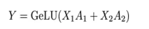

# 分布式框架基础概念

NVIDIA Megatron 是一个基于 PyTorch 的框架，用于训练基于 Transformer 架构的巨型语言模型（chatgpt-3为代表）。用于分布式并行超大语言模型预训练。这的Transformer架构主要指狭义的decoder模块（llama为代表）。

#### 1.操作原语

- **Broadcast**：广播，从主节点广播至其他指定节点

  

- **Scatter**：与Broadcast类似，将数据不同部分发送给其他节点。

- **Reduce**：规约运算，包括SUM，MIN，MAX，PRROD，LOR等类型规约操作，在每个节点获取一个输入元素数组，执行操作得到结果。

  

  - **AllReduce**：在所有节点实现Reduce。最简单策略是将一个节点数据分发给其他所有节点，但资源浪费严重。使用主从式架构，存在一个master和多个worker，后者把数据发送给前者计算后分发，但容易成为网络瓶颈。
    - 使用Ring AllReduce：将N个worker分布在一个环上，把每个worker数据分成N等分，第k个worker把第k份数据发给下一个worker，并接受上一个的第k-1份数据，进行整合运算，在滚动N次后，每个worker都有整合结果的1份，且过程处理数量不出现瓶颈。

  

  - **Gather**：将多个节点上的数据收集到单个节点，理解为反向Scatter。
  - **AllGather**：收集所有数据到所有节点，为Gather+Broadcast

  

  - **ReduceScatter**：将各节点输入求和，切分并分发到相应卡。

  

  

#### 2.并行计算

**2.1 数据并行**

- **Data Parallel**：本质式单机上单进程多线程。将模型加载到主GPU，复制到各指定从GPU，按Batch维度拆分，独立进行forward计算，将结果同步给主GPU，更新后参数复制到从GPU。存在负载不均衡，通信开销大的问题。

- **Distribution** **Data** **Parallel**：采用AllReduce架构，负载分散在每个GPU，通信成本恒定，与GPU数量无关。

**2.2 张量并行**(横切)

将张量(Tensor)操作划分到多个设备上，加速计算或增加模型大小。通信发生在每层的前向和后向传播，通信类型为AllReduce，通信频繁且信息量大。

Transformer中主要包括 Multi Self Attention和Feed Forward部分。对于Feed Forward，有多个全连接层MLP网络组成，每层由矩阵乘和GeLU激活或Dropout组成。一个全连接层可表示为：

切分方式：

得到：

将每个self attention分到不同的GPU计算，最后全连接层按行方向切，权重矩阵按列方向切输入Y计算，AllReduece操作得到结果。

**2.3 流水并行**（纵切）

每个阶段和下一个阶段之间仅有相邻的某个Tensor数据需要传输，每台机器的数据传输量跟总的网络大小，机器总数，并行规模无关。通信类型主要为P2P，每次通信数量少但较为频繁，引入核外GPU空闲等待时间。

但这样做的空泡比率较高，有资源浪费。一种解决方法PipeDream是通过形成1前向1反向的形式，降低空泡占比。另一种Vitual Piplinee是通过增加更多pipline stage，以更多通信量换取低空泡比率。

**梯度累加**：Gradient Accumulation把一个大Batch拆分成多个micro-batch，每个micro-bathc前后向计算后的梯度累加，在最后一个micro-batch累加结束后，统一更新模型。相比数据并行空间上的维度，micro-batch是时间上的数据并行，将数据拆分成多个tensor，按时序一次进入同一个设备穿行计算，最后结果梯度累加。

**激活检查点**：Checkpointing在前向网络中标记少量Tensor，计算中这些Tensor被保留，其余前向Tensor会通过在反向传播中根据Checkpointing的Tensor临时重新计算一遍前向得到。提升内存复用效率。

**ZeRO**：将模型训练阶段每张显卡中内容分两类，模型状态和剩余状态，通过分片进行存储优化。

参考1：https://blog.csdn.net/c9Yv2cf9I06K2A9E/article/details/130570164

参考2：https://zhuanlan.zhihu.com/p/420207439?utm_id=0

参考3：https://zhuanlan.zhihu.com/p/420207439

